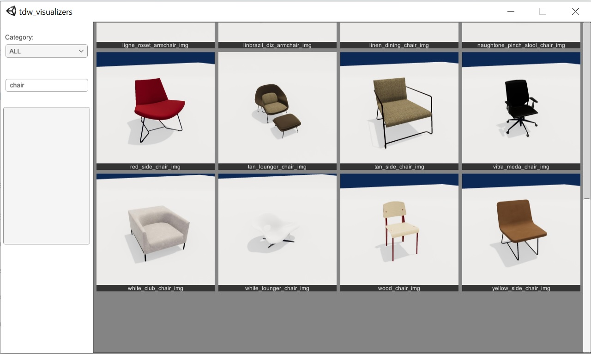

# README

Usage the visualizer applications to view and filter images of TDW assets. The Model Visualizer will show images of models. The Material Visualizer will show images of visual materials.



## Usage

1. [**Download the visualizer binaries.**](https://github.com/threedworld-mit/tdw_visualizers/releases/latest)

2. **Generate the images with the "screenshotter" controller.** This can be found in the tdw repo.

```bash
cd <root>/tdw/Python
```

For models:

```bash
python3 screenshotter.py
```

For materials:

```bash
python3 screenshotter.py --type materials
```

3. **Run the visualizer application.**